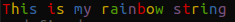

      ____            _         ___                    _        
     / ___|___  _ __ | |_ __ _ / _ \ _   _  __ _ _ __ | |_ ___  
    | |   / _ \| '_ \| __/ _` | | | | | | |/ _` | '_ \| __/ _ \ 
    | |__| (_) | | | | || (_| | |_| | |_| | (_| | | | | || (_) |
     \____\___/|_| |_|\__\__,_|\__\_\\__,_|\__,_|_| |_|\__\___/ 
                                                                

Welcome to the Quanto Commons repository!
These are tools / constants / models that are shared among
our projects. Feel free to contribute / make it better.


## QuantoColors

`QuantoColors` uses the `node-colors` package and makes a standard color
display over our applications. To use it just import `QuantoColors` from 
`quanto-commons` and run it:

```javascript
import { QuantoColors } from 'quanto-commons';

QuantoColors();
```
Then you should be able to use like this in any string:

```javascript
const myRainbowString = 'This is my rainbow string'.rainbow;
console.log(myRainbowString);
```

should output:




The  **current** usable color set is:

*   `silly` => `rainbow`
*   `input` => `grey`
*   `verbose` => `cyan`
*   `prompt` => `grey`
*   `info` => `green`
*   `data` => `grey`
*   `help` => `cyan`
*   `warn` => `yellow`
*   `debug` => `blue`
*   `error` => `red`

## printQuantoHeader

This call is used to print out headers like this:


To use it's very simple.

```javascript
import { printQuantoHeader } from 'quanto-commons';

printQuantoHeader('Quanto Commons', 'Test');
```

The second parameter is optional and denotes the second line.

## ErrorObject / ErrorCodes

The `ErrorObject` model is used across our applications to denote an 
error when returning or throwing an exception. It has five fields:

*   `errorCode` => A string from `ErrorCodes`
*   `stackTrace` => An optional string containing the stacktrace
*   `errorField` => An optional string containing the field related to the error
*   `message` => A brief message saying why the error ocurred
*   `errorDat` => An optional object that can contain extra data related to the error

The `ErrorCodes` is a type of enum that contains a map from a standard errorCode string to 
a good name to be used on `ErrorObject` (or other places).
